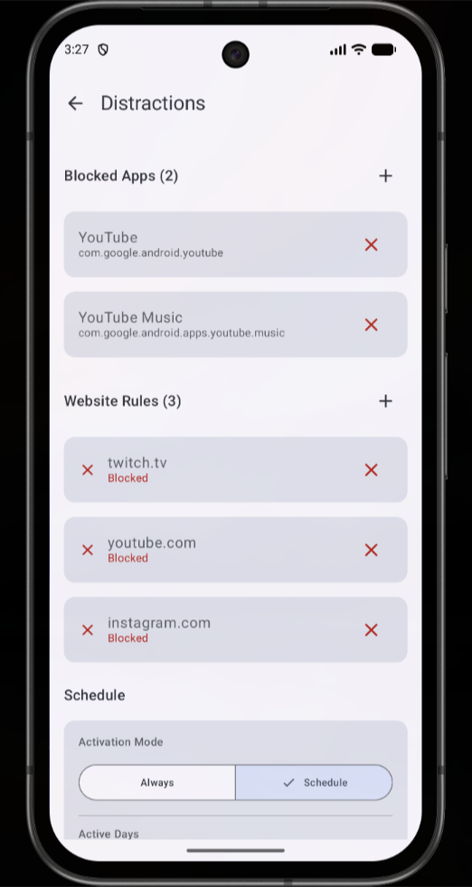
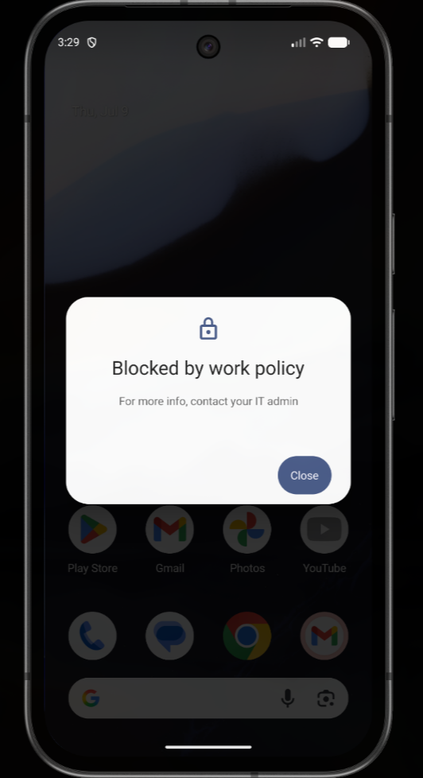
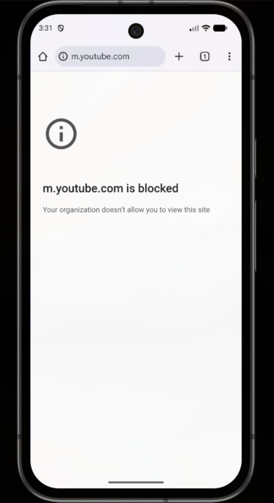
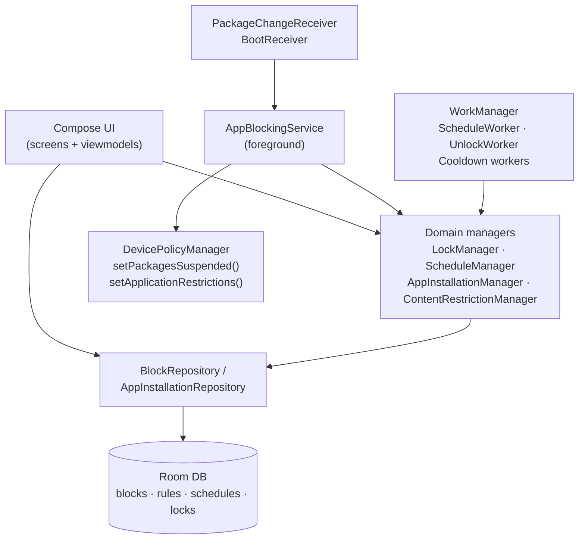

# SelfControl — Android App & Website Blocker

[](https://github.com/TTeuber/AndroidPhoneManager/actions/workflows/android.yml)
[](LICENSE)

An Android self-control app that blocks distracting apps and websites using **Device Owner APIs** — the same device-management layer used by enterprise MDM software. Unlike accessibility-service blockers, restrictions enforced at the Device Owner level cannot be bypassed by simply uninstalling the app.

<table>
  <tr>
    <td align="center"></td>
    <td align="center"></td>
    <td align="center"></td>
  </tr>
</table>

## Features

- **Blocks** — Named groups of app and website rules, toggled on/off from the main screen
- **Schedules** — Automatically activate blocks on chosen days and time ranges, including overnight windows (e.g. 10 PM – 6 AM)
- **Locks** — Commit to a block by locking it until a date, for a timer duration, or forever; locked blocks can _add_ restrictions but never _remove_ them
- **Website blocking** — Pushes URL blocklists directly into Chrome via managed configurations; also forces Google SafeSearch, YouTube Restricted Mode, and disables incognito mode
- **App installation control** — New installs are evaluated against an allowlist/blacklist; restricted categories (social, games, browsers, entertainment) require a 24-hour cooldown with a limited approval window

## Why Device Owner?

Most app blockers rely on accessibility services or usage-stats polling, which the user can disable in seconds. This app is provisioned as **Device Owner** (`dpm set-device-owner`), which unlocks:

- `DevicePolicyManager.setPackagesSuspended()` — apps are suspended at the OS level, not just covered by an overlay
- `setApplicationRestrictions()` — Chrome's managed configuration accepts URL blocklists, SafeSearch, and incognito policies the same way corporate IT would push them
- Uninstall protection — the app cannot be removed without deliberately clearing Device Owner status (itself lockable inside the app)

## Engineering Highlights

A few problems that turned out to be more interesting than they looked:

- **Add-only lock semantics.** A locked block must allow _tightening_ (add an app, extend the lock) while forbidding _loosening_ (remove a rule, disable, shorten). `LockManager` models every operation as an explicit `LockOperation` enum checked against lock state, so the rule is enforced in one place instead of scattered through the UI.
- **Overnight schedules.** A 10 PM – 6 AM schedule on "Monday" needs to stay active into Tuesday morning — evaluation checks both "today after start" and "yesterday enabled, before end," including the Sunday→Monday week wraparound.
- **Three-source blocking.** The suspended-package set is the union of (1) rules from active blocks, (2) a permanent blacklist, and (3) any non-system app not on the allowlist — so a newly sideloaded app is blocked by default the moment `PackageChangeReceiver` sees it.
- **Surviving reboots and rebuilds.** A `BootReceiver` restarts the foreground service, WorkManager re-schedules the periodic workers, and debug builds sign with the same release keystore so Device Owner status survives every `adb install` during development.
- **Fail-safe installation gating.** If Play Store page parsing fails or a category can't be determined, the app errs toward requiring the cooldown rather than allowing the install.

## Architecture

Standard layered architecture: Compose UI → ViewModels → Repositories/Domain managers → Room + DataStore, with Hilt wiring everything together.



```
app/src/main/java/com/tyler/selfcontrol/
├── data/
│   ├── model/         # Room entities (Block, Schedule, Lock, AppRule, ...)
│   ├── dao/           # Database access objects
│   ├── database/      # Room database + type converters
│   ├── datastore/     # DataStore-backed settings
│   └── repository/    # Data repositories
├── domain/            # Business logic
│   ├── LockManager.kt             # Lock enforcement (add-only semantics)
│   ├── ScheduleManager.kt         # Schedule evaluation, incl. overnight
│   ├── ContentRestrictionManager.kt  # Chrome managed configurations
│   ├── AppInstallationManager.kt  # Install gating + cooldowns
│   └── PlayStoreParser.kt         # Category detection from Play Store pages
├── service/           # AppBlockingService (foreground enforcement)
├── worker/            # ScheduleWorker, UnlockWorker, cooldown workers
├── receiver/          # Boot, package-change, device-admin receivers
└── ui/                # Compose screens, viewmodels, components
```

**Tech stack:** Kotlin 2.0 · Jetpack Compose · Room · Hilt · WorkManager · DataStore · Jsoup

## How It Works

### App blocking

`AppBlockingService` runs as a foreground service and computes the suspended-package set from three sources:

1. **Block rules** — apps belonging to blocks where
   `isEnabled && (state == ALWAYS_ON || isScheduleActive)`
2. **Blacklist** — permanently banned packages (Play Store, etc.)
3. **Allowlist gap** — non-system apps installed after setup that were never approved

The set is applied with `setPackagesSuspended()`, and the service also monitors the foreground app to immediately bounce attempts to open a suspended app.

### Website blocking

Instead of a custom browser, restrictions are pushed into Chrome itself via `setApplicationRestrictions()` — the managed-config channel enterprise policy uses. Active website rules become Chrome's `URLBlocklist`; the same channel forces `ForceGoogleSafeSearch`, `ForceYouTubeRestrict`, and `IncognitoModeAvailability = disabled` so blocked sites can't be visited privately.

### Schedules

- Days are a 7-bit bitmask (bit 0 = Sunday … bit 6 = Saturday); times are minutes from midnight
- Overnight ranges (end < start) span into the following day
- `ScheduleWorker` re-evaluates every few minutes and flips `isScheduleActive`

### Locks

- Modes: `UNLOCKED`, `UNTIL_DATETIME`, `TIMER`, `FOREVER`
- Timed locks can be extended (never shortened); forever locks are permanent
- `UnlockWorker` clears expired locks in the background

### Installation cooldowns

`PlayStoreParser` fetches an app's Play Store page with Jsoup and classifies it (social / entertainment / video / game / browser). Restricted categories create a `CooldownRequest`: the app can only be approved during a 3–6 PM window the following day, after which the request expires.

## Testing

Unit tests cover the core domain logic — schedule evaluation (including overnight and week-wraparound edge cases), lock rules and add-only semantics, and Play Store category parsing against real HTML fixtures:

```bash
./gradlew testDebugUnitTest
```

Tests run in CI on every push, along with lint and a full debug build.

## Setup

> **Note:** Device Owner provisioning requires a factory-reset device (or fresh emulator) with no Google account. This is an Android platform requirement, not an app limitation.

```bash
# 1. Build
./gradlew assembleDebug

# 2. Install (emulator shown; use -d for a physical device)
adb -e install -r -t app/build/outputs/apk/debug/app-debug.apk

# 3. Provision as Device Owner
adb shell dpm set-device-owner com.tyler.selfcontrol/.receiver.SelfControlDeviceAdminReceiver

# Verify
adb shell dumpsys device_policy
```

Once set, Device Owner status can only be removed via the in-app "Clear Device Owner" button (which is itself lockable) or a factory reset.

### Signing

If a `keystore.properties` file is present, both debug and release builds sign with that keystore so the app's signature — and therefore its Device Owner status — survives reinstalls during development. Without it (e.g. in CI), builds fall back to the default debug signing.

```properties
# keystore.properties (not committed)
storeFile=selfcontrol.keystore
storePassword=...
keyAlias=selfcontrol
keyPassword=...
```

## Known Limitations

- Requires Device Owner status, so setup needs a factory-reset device
- Website restrictions apply to Chrome (managed configurations); other browsers are handled by blocking them as apps
- Play Store page parsing can break if Google changes the page structure (fails safe: cooldown required)
- Some system apps cannot be suspended

## License

[MIT](LICENSE)
